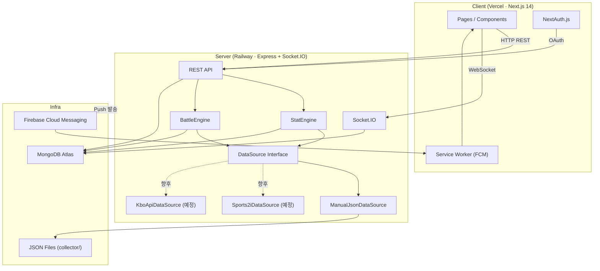

# ARCHITECTURE.md — BeastLeague (비스트리그)

> 작성일: 2026-03-23  
> 작성: Claw (리드 개발자)  
> 버전: 0.1 (프로토타입 단계)

---

## 1. 시스템 아키텍처 다이어그램



**핵심 원칙:** 모든 KBO 데이터 접근은 `DataSource` 인터페이스를 통한다. `StatEngine`과 `BattleEngine`은 구현체를 모른다.

---

## 2. MongoDB 스키마 정의

### 2-1. Users

```ts
{
  _id: ObjectId,
  provider: 'kakao' | 'google',
  providerId: string,            // OAuth 제공자 uid
  nickname: string,
  email: string,
  fcmToken: string,              // FCM 푸시 토큰
  createdAt: Date,
  updatedAt: Date
}
```

**인덱스:**
- `{ provider: 1, providerId: 1 }` — unique (OAuth 중복 가입 방지)
- `{ fcmToken: 1 }` — 푸시 발송용

---

### 2-2. Characters

```ts
{
  _id: ObjectId,
  userId: ObjectId,              // ref: Users
  animalType: string,            // 'bear' | 'fox' | ... (추후 확장)
  name: string,

  level: number,                 // 1–99
  xp: number,                    // 현재 누적 XP
  diligence: number,             // 성실도 (0–100)

  stats: {
    power:   number,             // 1–100
    agility: number,
    skill:   number,
    stamina: number,
    mind:    number
  },

  cosmeticIds: string[],         // 보유 코스메틱 ID 목록
  equippedCosmeticId: string,

  createdAt: Date,
  updatedAt: Date
}
```

**인덱스:**
- `{ userId: 1 }` — unique (유저당 캐릭터 1개)
- `{ level: -1 }` — 랭킹 조회용

---

### 2-3. Games

```ts
{
  _id: ObjectId,
  gameId: string,                // 고유 경기 ID (DataSource 기준)
  date: string,                  // "2026-03-23"
  homeTeam: string,              // 연고지 약칭: "서울L"
  awayTeam: string,
  status: 'scheduled' | 'in_progress' | 'final' | 'cancelled' | 'postponed',
  homeScore: number,
  awayScore: number,
  importedAt: Date               // ManualJson 업로드 시각
}
```

**인덱스:**
- `{ gameId: 1 }` — unique
- `{ date: 1 }` — 날짜별 경기 목록 조회
- `{ status: 1 }` — 진행 중 경기 필터

---

### 2-4. BatterGroups

경기 내 타순 그룹별 합산 스탯 (DataSource에서 파싱 후 저장)

```ts
{
  _id: ObjectId,
  gameId: string,                // ref: Games.gameId
  team: string,                  // 연고지 약칭
  groupType: 'top' | 'cleanup' | 'bottom',  // 상위·클린업·하위 타선

  // 그룹 합산 성적
  hits: number,
  doubles: number,
  triples: number,
  homeRuns: number,
  rbi: number,
  runs: number,
  walks: number,
  strikeouts: number,
  stolenBases: number,
  plateAppearances: number,
  multiHitPlayers: number        // 멀티히트 기록 선수 수
}
```

**인덱스:**
- `{ gameId: 1, team: 1, groupType: 1 }` — unique

---

### 2-5. Placements

유저가 아침에 선택한 팀 + 타순 그룹

```ts
{
  _id: ObjectId,
  userId: ObjectId,
  gameId: string,
  date: string,
  team: string,
  groupType: 'top' | 'cleanup' | 'bottom' | 'starter_pitcher',
  lockedAt: Date,                // 선택 확정 시각 (경기 시작 후 변경 불가)
  statApplied: boolean,          // 경기 종료 후 스탯 반영 완료 여부
  createdAt: Date
}
```

**인덱스:**
- `{ userId: 1, date: 1 }` — unique (하루 1회 선택)
- `{ gameId: 1, statApplied: 1 }` — 정산 배치 처리용

---

### 2-6. StatLogs

캐릭터 스탯 변화 이력

```ts
{
  _id: ObjectId,
  userId: ObjectId,
  characterId: ObjectId,
  date: string,
  source: 'game' | 'training' | 'battle',
  delta: {
    power:   number,
    agility: number,
    skill:   number,
    stamina: number,
    mind:    number,
    xp:      number
  },
  reason: string,                // e.g. "홈런 2개 → Power +6"
  createdAt: Date
}
```

**인덱스:**
- `{ userId: 1, createdAt: -1 }` — 유저별 최근 이력
- `{ characterId: 1, date: 1 }` — 날짜별 스탯 변화 조회

---

### 2-7. Battles

일일 대결 결과

```ts
{
  _id: ObjectId,
  gameId: string,
  date: string,
  playerA: ObjectId,             // ref: Users
  playerB: ObjectId,
  groupType: 'top' | 'cleanup' | 'bottom' | 'starter_pitcher',

  scoreA: number,                // 스탯 합산 점수
  scoreB: number,
  result: 'a_win' | 'b_win' | 'draw',

  xpReward: {
    playerA: number,
    playerB: number
  },

  resolvedAt: Date,
  createdAt: Date
}
```

**인덱스:**
- `{ gameId: 1, playerA: 1, playerB: 1 }` — unique
- `{ playerA: 1, date: 1 }`, `{ playerB: 1, date: 1 }` — 유저별 대결 이력

---

### 2-8. Trainings

낮 미니 훈련 기록

```ts
{
  _id: ObjectId,
  userId: ObjectId,
  date: string,
  slot: 1 | 2 | 3,              // 하루 최대 3회
  trainingType: string,          // 훈련 종류 ID
  choiceKey: string,             // 선택한 버튼 키
  xpGained: number,
  statDelta: {
    power: number, agility: number, skill: number,
    stamina: number, mind: number
  },
  completedAt: Date
}
```

**인덱스:**
- `{ userId: 1, date: 1, slot: 1 }` — unique (슬롯 중복 방지)

---

### 2-9. Rankings

주간/월간 랭킹 스냅샷 (배치 집계 결과 캐시)

```ts
{
  _id: ObjectId,
  period: 'weekly' | 'monthly',
  periodKey: string,             // "2026-W12", "2026-03"
  rank: number,
  userId: ObjectId,
  characterId: ObjectId,
  totalXp: number,
  totalWins: number,
  snapshot: {                    // 해당 시점 스탯
    level: number,
    stats: { power, agility, skill, stamina, mind }
  },
  createdAt: Date
}
```

**인덱스:**
- `{ period: 1, periodKey: 1, rank: 1 }` — 랭킹 페이지 조회
- `{ userId: 1, period: 1, periodKey: 1 }` — 내 순위 조회

---

## 3. REST API 전체 목록

> `🔐` = NextAuth 세션 인증 필요

### Auth

| Method | Endpoint | 설명 | 인증 |
|--------|----------|------|------|
| GET | `/api/auth/[...nextauth]` | NextAuth OAuth 핸들러 | — |

---

### Users

| Method | Endpoint | 설명 | 인증 |
|--------|----------|------|------|
| GET | `/api/users/me` | 내 프로필 조회 | 🔐 |
| PATCH | `/api/users/me` | 닉네임 수정 | 🔐 |
| POST | `/api/users/me/fcm-token` | FCM 토큰 등록/갱신 | 🔐 |

---

### Characters

| Method | Endpoint | 설명 | 인증 |
|--------|----------|------|------|
| GET | `/api/characters/me` | 내 캐릭터 조회 | 🔐 |
| POST | `/api/characters` | 캐릭터 생성 (최초 1회) | 🔐 |
| PATCH | `/api/characters/me/cosmetic` | 코스메틱 장착 변경 | 🔐 |

**GET /api/characters/me 응답 예시:**
```json
{
  "characterId": "abc123",
  "animalType": "bear",
  "name": "곰돌이",
  "level": 5,
  "xp": 430,
  "diligence": 72,
  "stats": { "power": 34, "agility": 28, "skill": 41, "stamina": 55, "mind": 30 }
}
```

---

### Games

| Method | Endpoint | 설명 | 인증 |
|--------|----------|------|------|
| GET | `/api/games?date=2026-03-23` | 날짜별 경기 목록 | 🔐 |
| GET | `/api/games/:gameId` | 경기 상세 | 🔐 |
| GET | `/api/games/:gameId/batter-groups` | 타순 그룹 합산 스탯 | 🔐 |

**GET /api/games?date=2026-03-23 응답 예시:**
```json
[
  {
    "gameId": "2026-0323-SSL-GJ",
    "date": "2026-03-23",
    "homeTeam": "서울L",
    "awayTeam": "광주",
    "status": "scheduled",
    "homeScore": null,
    "awayScore": null
  }
]
```

---

### Placements (경기 선택)

| Method | Endpoint | 설명 | 인증 |
|--------|----------|------|------|
| POST | `/api/placements` | 오늘 팀·타순 그룹 선택 | 🔐 |
| GET | `/api/placements/today` | 오늘 내 선택 조회 | 🔐 |

**POST /api/placements 요청 예시:**
```json
{
  "gameId": "2026-0323-SSL-GJ",
  "team": "서울L",
  "groupType": "cleanup"
}
```

---

### Trainings (미니 훈련)

| Method | Endpoint | 설명 | 인증 |
|--------|----------|------|------|
| GET | `/api/trainings/today` | 오늘 훈련 현황 (3슬롯) | 🔐 |
| POST | `/api/trainings` | 훈련 완료 제출 | 🔐 |

**POST /api/trainings 요청 예시:**
```json
{
  "slot": 1,
  "trainingType": "swing",
  "choiceKey": "power_focus"
}
```

---

### Battles

| Method | Endpoint | 설명 | 인증 |
|--------|----------|------|------|
| GET | `/api/battles/today` | 오늘 대결 결과 | 🔐 |
| GET | `/api/battles/history?page=1` | 대결 이력 (페이지네이션) | 🔐 |

---

### Rankings

| Method | Endpoint | 설명 | 인증 |
|--------|----------|------|------|
| GET | `/api/rankings?period=weekly&key=2026-W12` | 주간/월간 랭킹 | 🔐 |
| GET | `/api/rankings/me?period=weekly&key=2026-W12` | 내 순위 | 🔐 |

---

### Internal (서버 내부 / collector → server)

| Method | Endpoint | 설명 | 인증 |
|--------|----------|------|------|
| POST | `/internal/games/import` | ManualJson 경기 데이터 등록 | API Key |
| POST | `/internal/games/:gameId/finalize` | 경기 종료 정산 트리거 | API Key |

> `/internal/*` 엔드포인트는 외부 노출 금지. 환경변수 `INTERNAL_API_KEY`로 인증.

---

## 4. Socket.IO 이벤트 목록

### 연결 / 룸

클라이언트는 연결 시 자동으로 개인 룸 `user:{userId}`에 입장.  
경기 구독 시 `game:{gameId}` 룸에 join.

---

### 클라이언트 → 서버

| 이벤트 | 페이로드 | 설명 |
|--------|----------|------|
| `game:subscribe` | `{ gameId: string }` | 경기 피드 구독 시작 |
| `game:unsubscribe` | `{ gameId: string }` | 구독 해제 |

---

### 서버 → 클라이언트

| 이벤트 | 페이로드 | 방향 | 설명 |
|--------|----------|------|------|
| `game:status_update` | `{ gameId, status, homeScore, awayScore, inning }` | room `game:{gameId}` | 경기 상태 변경 (45초 폴링 결과) |
| `game:group_stats_update` | `{ gameId, team, groupType, stats }` | room `game:{gameId}` | 타순 그룹 성적 업데이트 |
| `game:final` | `{ gameId, homeScore, awayScore }` | room `game:{gameId}` | 경기 종료 |
| `character:stat_updated` | `{ delta, reason, newStats, newXp, newLevel }` | room `user:{userId}` | 스탯 반영 완료 알림 |
| `battle:result` | `{ battleId, result, xpReward }` | room `user:{userId}` | 대결 결과 도착 |
| `training:slot_available` | `{ slot, availableAt }` | room `user:{userId}` | 훈련 슬롯 해금 알림 |

---

## 5. 일일 데이터 플로우 타임라인

```
[아침 ~09:00] 경기 전
──────────────────────────────────────────────────────
  collector/   ManualJson 파일 준비 (관리자 작성)
       ↓
  POST /internal/games/import
       ↓
  Games 컬렉션 upsert + status: 'scheduled'
       ↓
  클라이언트: GET /api/games?date=today
       ↓
  유저: 팀 + 타순 그룹 선택 → POST /api/placements
       ↓
  Placements 컬렉션 저장 (경기 시작 시각 이후 변경 불가 — lockedAt 체크)

[낮 10:00–17:00] 미니 훈련
──────────────────────────────────────────────────────
  유저: 3회 훈련 버튼 선택 → POST /api/trainings
       ↓
  StatEngine: XP + 소량 스탯 계산
       ↓
  Characters 업데이트 + StatLogs 기록
       ↓
  Socket: character:stat_updated → 클라이언트 실시간 반영

[저녁 ~17:00–21:00] 경기 중 (45초 폴링)
──────────────────────────────────────────────────────
  서버 Scheduler (setInterval 45s):
    DataSource.getGame(gameId)  ← ManualJson 또는 향후 API
       ↓
    status 변경 감지 → Games 업데이트
       ↓
    BatterGroups 합산 스탯 업데이트
       ↓
    Socket: game:status_update + game:group_stats_update
       → room game:{gameId} 브로드캐스트
       ↓
  클라이언트: 45초마다 피드 갱신 (유저 선택 그룹 하이라이트)

[밤 경기 종료 후] 정산
──────────────────────────────────────────────────────
  DataSource → status: 'final' 감지
       ↓
  POST /internal/games/:gameId/finalize (자동 or 수동 트리거)
       ↓
  StatEngine.apply(placement, batterGroupStats):
    스탯 반영 규칙 계산 → Characters 업데이트
    StatLogs 기록
    Socket: character:stat_updated → 유저 개인 룸
       ↓
  BattleEngine.resolve(gameId):
    같은 gameId·groupType 선택자 매칭 → 스탯 비교
    Battles 컬렉션 저장
    Socket: battle:result → 유저 개인 룸
    FCM 푸시 발송 (백그라운드 유저용)
       ↓
  Rankings 배치 업데이트 (자정 cron)
```

---

## 6. 위험 포인트 및 대응 방안

### 6-1. 데이터 파이프라인 리스크

| 위험 | 영향 | 대응 |
|------|------|------|
| ManualJson 업로드 누락/지연 | 당일 서비스 불가 | `/internal/games/import` 응답에 검증 에러 포함. 관리자 알림(FCM 또는 이메일) |
| JSON 필드 오타·누락 | 정산 오류 | `GameData` Zod 스키마 검증 → import 단계에서 reject. 에러 메시지 구체화 |
| 정산 중 서버 재시작 | 이중 정산 or 누락 | `statApplied` 플래그 + 멱등성 보장 (같은 gameId 재정산 시 skip) |
| DataSource 교체 시 스키마 불일치 | 런타임 에러 | `DataSource` 인터페이스 + Zod 검증을 어댑터 레이어에 강제 |

---

### 6-2. 법적 리스크

| 위험 | 대응 |
|------|------|
| 선수 개인정보 노출 | `BatterGroups`는 그룹 합산만 저장. 개별 선수 데이터 DB 비저장. UI에 개인 식별 정보 렌더링 금지 |
| 구단 로고/명칭 | 연고지 약칭만 사용 (`서울L`, `광주` 등). 공식 명칭·로고 에셋 프로젝트에서 완전 배제 |
| 크롤링 | `DataSource` 인터페이스 구현체에 크롤러 추가 요청 시 거부. 코드 리뷰 체크리스트에 포함 |
| 현금화 | 게임 재화 → 현금 전환 경로 없음. 향후 인앱결제 도입 시 법무 검토 필수 |

---

### 6-3. 성능 병목

| 병목 지점 | 예상 규모 | 대응 |
|-----------|-----------|------|
| 경기 종료 후 동시 정산 | 유저 N명 × 경기 수 | 배치 처리 (Placement 목록 iterate) + bulkWrite |
| 45초 폴링 소켓 브로드캐스트 | 경기당 구독자 수백 명 | Socket.IO room 브로드캐스트로 N:1 최적화. 폴링은 서버 1개 스케줄러만 실행 |
| 랭킹 집계 | 전체 유저 스캔 | 자정 배치 + Rankings 컬렉션 캐시. 실시간 집계 금지 |
| MongoDB Atlas 무료 tier | 512MB, 연결 수 제한 | 초기엔 충분. MAU 1,000 초과 시 M10($57/월) 업그레이드 검토 |

---

### 6-4. 인증·보안

| 항목 | 대응 |
|------|------|
| `/internal/*` 외부 노출 | Vercel에서 서버 직접 접근 불가. Railway/Render 환경변수로 `INTERNAL_API_KEY` 관리 |
| JWT 탈취 | NextAuth 세션 + httpOnly 쿠키. 클라이언트 localStorage 토큰 저장 금지 |
| 훈련/배치 조작 | 서버 사이드 시각 검증 (`lockedAt`, 슬롯 중복 체크). 클라이언트 값 신뢰 금지 |

---

*다음 문서: `docs/STAT_ENGINE.md` (스탯 반영 공식 상세), `docs/DATA_FLOW.md` (collector 운영 가이드)*
